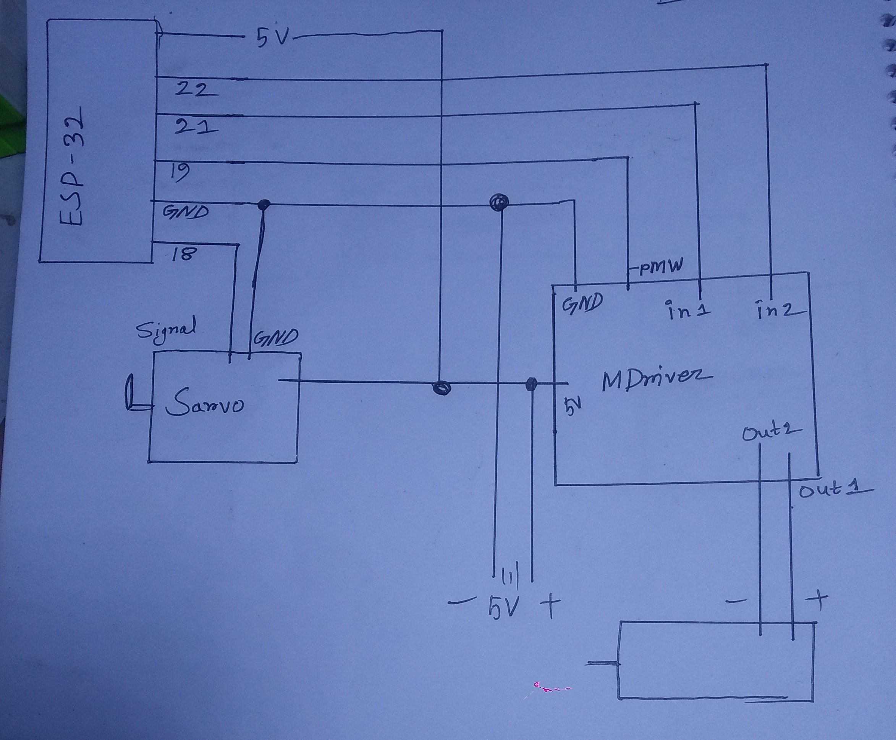

### Uplode Date: <b> <i>17 March 2026 </i> <b>

# MH2 ESP32 Car Control

A comprehensive **ESP32-based car control system** with web interface that allows you to control the steering, gears, motor, and brakes in real-time.

## Features
- **Wi-Fi AP Mode:** Connect directly to ESP32 via a local Wi-Fi network.
- **Interactive Steering Wheel:** Smooth, drag-and-rotate wheel interface with live servo feedback.
- **Gear Control:** P, N, D, R gear selection.
- **Motor Control:** Start/Stop motor with safety interlock.
- **Brake Function:** Toggle brake state to stop motor instantly.
- **Stylish Web Interface:** Modern black & neon-blue theme, responsive design for mobile and desktop.

## Hardware Requirements
- **ESP32 development board**
- **Servo motor** for steering
- **DC gear motor** with driver
- Push buttons (optional for physical testing)
- Power supply for ESP32 and motors

## Connections
| Component      | ESP32 Pin |
|----------------|-----------|
| Steering Servo | 18        |
| Motor PWM      | 19        |
| Motor DIR1     | 21        |
| Motor DIR2     | 22        |

## Usage
1. Upload the code to your ESP32 board.
2. Connect to Wi-Fi network: `MH HRIDOY`, password: `12345678`.
3. Open browser and go to `192.168.4.1`.
4. Control the car using the web interface.

## Screenshots
*(Add screenshots of your web interface and car control here)*

## License
MIT License
